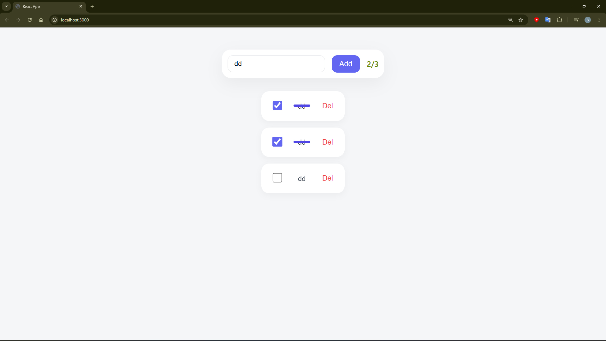

# To Do List (Project React - 2026)
> every day - day for learning

### Main:
I saw on YouTube that someone made a ToDoList on react and I wanted to try also. His website also seem very pretty so also I want to try make a good visulation.

### Logic:
* Enter tasks from user and adding when press on button "Add"
* Delete specific that task where user press on button "Del"
* 

### Visual:
* Input task and button for adding
* list (flex) of task from top to down
  * task have three elements: 
    1. Checkbox
    2. Text 
    3. Button (delete)
* label that show how much tasks you do from all your tasks (in proccess)
* Main Colors: `Blue`, `White` and `Light Blue`

### Photo From The Website:

--- 

#### brean Storm:
- progress bar ?
  - visulation of that how much task you have to do ?
- animation of creating and removing task?
  - scaleX 0 -> scaleX 1 | for creating ?
  - scaleX 1 -> scaleX 0 -> delete | for deleting ?
-  add saving task also after page's update and exit from page 